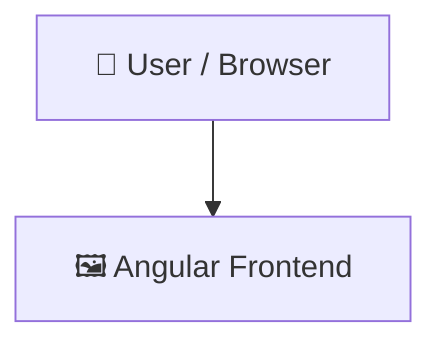
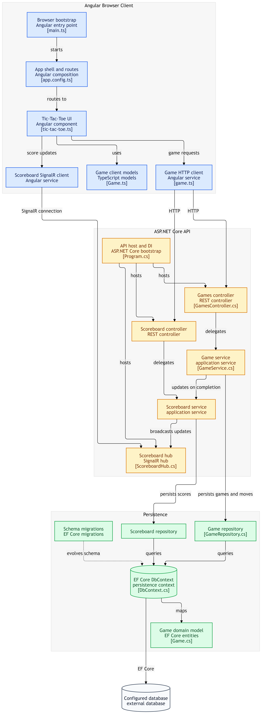

# Ticktacktoe-App

> A browser-based Tic-Tac-Toe application built with Angular and .NET.
## 📑 Table of Contents

- [Description](#description)
- [Key Features](#key-features)
- [Use Cases](#use-cases)
- [Tech Stack](#tech-stack)
- [Architecture](#architecture)
- [Quick Start](#quick-start)
- [Key Dependencies](#key-dependencies)
- [Available Scripts](#available-scripts)
- [Project Structure](#project-structure)
- [Development Setup](#development-setup)
- [Testing](#testing)
- [Contributors](#contributors)
- [Contributing](#contributing)
- [License](#license)

## 📝 Description

Ticktacktoe-App is a web application that brings the classic Tic-Tac-Toe game to the browser. It offers an interactive user experience for playing games directly in a modern web browser interface.  The project is structured as a full-stack application. The frontend is built with Angular and TypeScript located in the client-app directory, using Angular standalone application bootstrapping. The backend is powered by a .NET application inside the TicTacToeApp directory.  This repository is ideal for developers seeking a reference implementation of an Angular single-page application integrated with a .NET backend service.

## ✨ Key Features

- **🅰️ Angular Frontend Application** — Built using Angular and TypeScript within the client-app directory using standalone component bootstrapping.
- **⚙️ .NET Backend Service** — Contains backend logic and application structure in the TicTacToeApp directory executed via .NET tooling.
- **⚙️ WebSocket Service** — Contains WebSocket Services for RealTime Interactions.
- **🛠️ Integrated Development Scripts** — Includes npm and dotnet scripts for building, watching, serving, and testing the application.

## 🎯 Use Cases

- Playing Tic-Tac-Toe directly inside a web browser.
- Examining a reference architecture combining an Angular client with a .NET backend.
- Learning standalone application bootstrapping techniques in Angular and TypeScript.

## 🛠️ Tech Stack

  

**Notable libraries:** Vitest

## 🏗️ Architecture

A high-level view of how the main pieces fit together:



## ⚡ Quick Start

```bash

# 1. Clone the repository
git clone https://github.com/anshumandikshit/Ticktacktoe-App.git

# 2. Install dependencies
npm install

# 3. Start the dev server
npm run start
(Angular Server is running on : http://localhost:4200/)
```

## 📦 Key Dependencies

```
@angular/common: ^21.2.0
@angular/compiler: ^21.2.0
@angular/core: ^21.2.0
@angular/forms: ^21.2.0
@angular/platform-browser: ^21.2.0
@angular/router: ^21.2.0
@microsoft/signalr: ^10.0.11
rxjs: ~7.8.0
tslib: ^2.3.0
uuid: ^14.0.1
```

## 🚀 Available Scripts

- **ng** — `npm run ng`
- **start** — `npm run start`
- **build** — `npm run build`
- **watch** — `npm run watch`
- **test** — `npm run test`
- **run** — `dotnet run`
- **test** — `dotnet test`

## 📁 Project Structure

```
.
├── LICENSE
├── TicTacToeApp
│   ├── API
│   │   ├── API.csproj
│   │   ├── API.http
│   │   ├── Controllers
│   │   │   ├── GamesController.cs
│   │   │   ├── ScoreboardController.cs
│   │   │   └── WeatherForecastController.cs
│   │   ├── Data
│   │   │   └── DbContext.cs
│   │   ├── Enums
│   │   │   └── ApplicationEnumscs.cs
│   │   ├── Migrations
│   │   │   ├── 20260805183133_InitialCreate.Designer.cs
│   │   │   ├── 20260805183133_InitialCreate.cs
│   │   │   ├── 20260806151431_Non_Cluster_Index_Move_Table.Designer.cs
│   │   │   ├── 20260806151431_Non_Cluster_Index_Move_Table.cs
│   │   │   ├── 20260806154352_SessionId.Designer.cs
│   │   │   ├── 20260806154352_SessionId.cs
│   │   │   ├── 20260806155253_SessionIdToScoreBoard.Designer.cs
│   │   │   ├── 20260806155253_SessionIdToScoreBoard.cs
│   │   │   ├── 20260806160844_ScoreBoardTableUpdate.Designer.cs
│   │   │   ├── 20260806160844_ScoreBoardTableUpdate.cs
│   │   │   ├── 20260806161259_ScoreBoardTableUpdate_SessionId_Guid.Designer.cs
│   │   │   ├── 20260806161259_ScoreBoardTableUpdate_SessionId_Guid.cs
│   │   │   ├── 20260807045732_GameType_GameTable.Designer.cs
│   │   │   ├── 20260807045732_GameType_GameTable.cs
│   │   │   └── GameDbContextModelSnapshot.cs
│   │   ├── Models
│   │   │   ├── Game.cs
│   │   │   ├── Move.cs
│   │   │   └── Scoreboard.cs
│   │   ├── Program.cs
│   │   ├── Properties
│   │   │   └── launchSettings.json
│   │   ├── Repositories
│   │   │   ├── GameRepository.cs
│   │   │   ├── Interface
│   │   │   │   ├── IGameRepository.cs
│   │   │   │   └── IScoreboardRepository.cs
│   │   │   └── ScoreboardRepository.cs
│   │   ├── Services
│   │   │   ├── GameService.cs
│   │   │   ├── Interface
│   │   │   │   ├── IGameService.cs
│   │   │   │   └── IScoreboardService.cs
│   │   │   └── ScoreboardService.cs
│   │   ├── WeatherForecast.cs
│   │   ├── WebSocket
│   │   │   └── ScoreboardHub.cs
│   │   ├── appsettings.Development.json
│   │   └── appsettings.json
│   └── TicTacToeApp.sln
└── client-app
    ├── angular.json
    ├── package.json
    ├── public
    │   └── favicon.ico
    ├── src
    │   ├── app
    │   │   ├── app.config.ts
    │   │   ├── app.html
    │   │   ├── app.routes.ts
    │   │   ├── app.scss
    │   │   ├── app.spec.ts
    │   │   ├── app.ts
    │   │   ├── components
    │   │   │   └── tic-tac-toe
    │   │   │       └── ...
    │   │   ├── models
    │   │   │   ├── Game.ts
    │   │   │   ├── Move.ts
    │   │   │   └── ScoreBoard.ts
    │   │   └── services
    │   │       ├── ScoreBoardSignal.service.ts
    │   │       ├── game.spec.ts
    │   │       └── game.ts
    │   ├── index.html
    │   ├── main.ts
    │   └── styles.scss
    ├── tsconfig.app.json
    ├── tsconfig.json
    └── tsconfig.spec.json
```

## 🛠️ Development Setup

### Node.js / JavaScript
1. Install Node.js (v18+ recommended)
2. Install dependencies: `npm install` (or `yarn` / `pnpm install` / `bun install`)
3. Start the dev server: see the **Quick Start** above

### .NET
1. Install the [.NET SDK](https://dotnet.microsoft.com/)
2. `dotnet restore && dotnet run`
3. .NET Backend Server is running on (https://localhost:7199)
4. SignalR server is running on (https://localhost:7199/scoreboardHub)

## 🧪 Testing

This project uses **Vitest** for testing.

```bash
npm run test
```

## 👥 Contributors

Thanks to everyone who has contributed to this project:

<p align="left">
<a href="https://github.com/anshumandikshit" title="anshumandikshit"></a>
</p>

[See the full list of contributors →](https://github.com/anshumandikshit/Ticktacktoe-App/graphs/contributors)

## 👥 Contributing

Contributions are welcome! Here's the standard flow:

1. **Fork** the repository
2. **Clone** your fork: `git clone https://github.com/anshumandikshit/Ticktacktoe-App.git`
3. **Branch**: `git checkout -b feature/your-feature`
4. **Commit**: `git commit -m 'feat: add some feature'`
5. **Push**: `git push origin feature/your-feature`
6. **Open** a pull request

Please follow the existing code style and include tests for new behavior where applicable.

## 📜 License

This project is licensed under the **MIT** License.

---

<div align="center">

[](https://readmebuddy.com)

<sub>Generate beautiful READMEs in seconds → <a href="https://readmebuddy.com">readmebuddy.com</a></sub>

</div>

## 🏗️ Architecture Diagram


